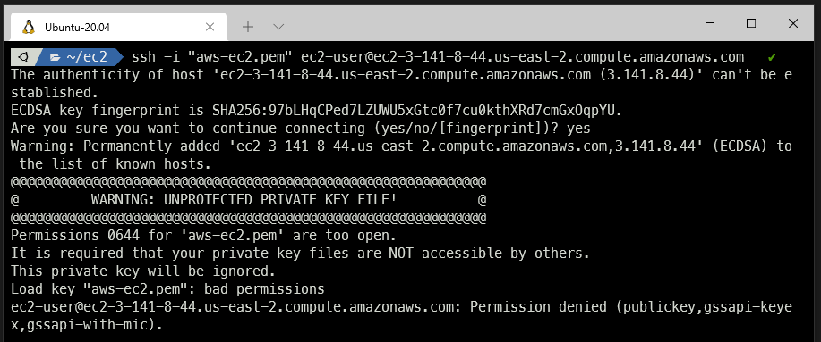
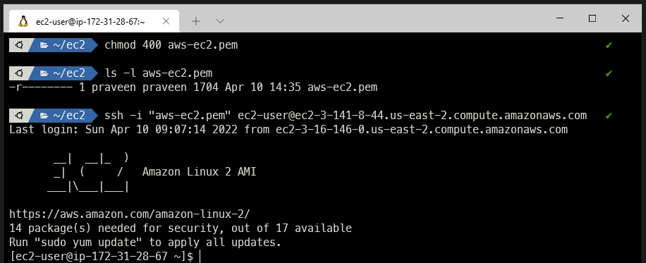
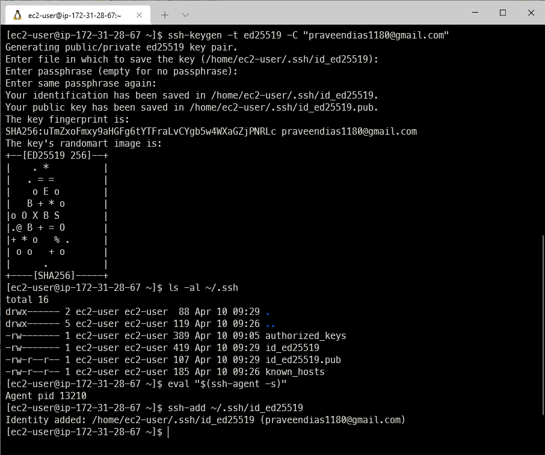

# AWS EC2

# Protect Your Private Keys!



# Connected to EC2 via SSH



# Install NVM

```
curl https://raw.githubusercontent.com/creationix/nvm/master/install.sh | bash 

source ~/.bashrc

nvm install lts/* 

node -v

npm -v
```

# Install Git

```
sudo yum install git

git --version
```

# SSH Config

```
ssh-keygen -t ed25519 -C "praveendias1180@gmail.com"

ls -al ~/.ssh

eval "$(ssh-agent -s)"

ssh-add ~/.ssh/id_ed25519
```


